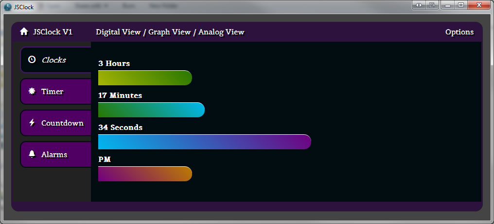
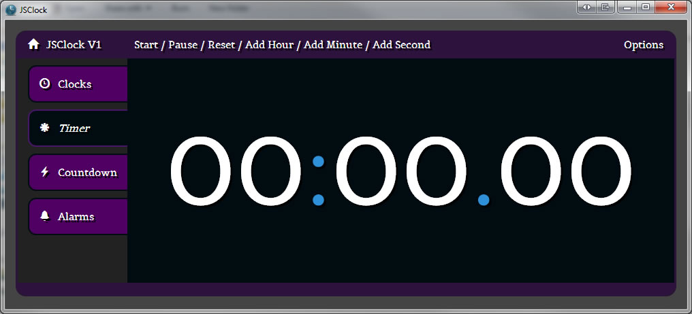

# MooClock aka. JSClock #

An attempt at making a community project for the MooTools forge.  Exclusively written in JabaScript with the MooTools framework.

## New Tick function ##

Now on every tick of the clock (1 second) all the *[module].tick()* functions will be called.  This is to keep custom timers running
in the background while the user can be viewing a different tab.

## Wiki ##

There is now a [Wiki for this project](https://github.com/hazlema/MooClock/wiki "wiki").  Stay tuned for more updates!

## Description ##

MooClock is a Desktop based clock that has many views and functions.  View the time as a Digital Clock as a Graph or even Analog.  User the timer as a stop watch to monitor the time spent on a project.  Use the countdown mode to time your dinners cook time!

## Structure ##

### Clock.js ###

This controls the entire app, the tabs on the left are modules that are plugged into clock.js

### Digital.js ###

This controls the variables and the rendering functions for the Digital Tab.

### Timer.js ###

This controls the variables and the rendering functions for the Timer Tab.

## TODO (Brief list and growing) ##

- Add the analog view

- Add a project tracking module

- Add the countdown timer

- Add alarms

- Add animation to changing views

- Add in [NodeJS](http://nodejs.org/) to allow for file system functions
 
- And lots more!

